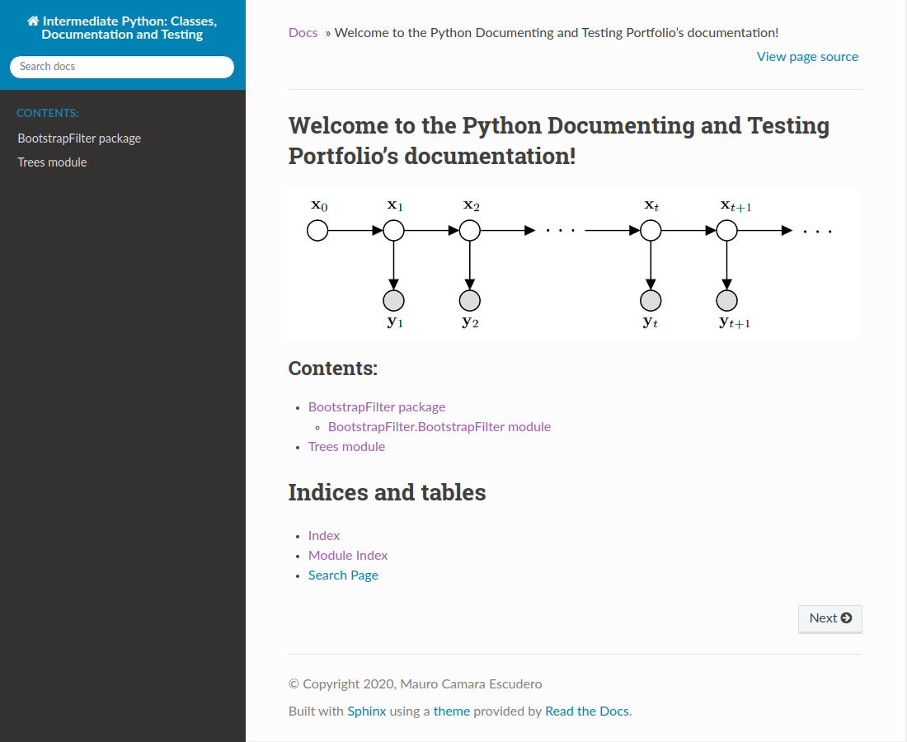

# Python Documentation and Testing
This repository can be used as a reference on how to document code using Sphinx. In this repository there is: 

- A package called `BootstrapFilter` containing one module `BootstrapFilter.py` inside which there is a class `BootstrapFilter`.
- A module `Trees.py` containing a class called `Node` and a function called `print_tree()`.

The generated sphinx documentation can be found in `docs/build/html/index.rst`.

